<p align="center">
  
</p>

# مرصد الفضاء الكامن

<p align="center" dir="rtl">
  <a href="README.md"></a>
  <a href="README.es.md"></a>
  <a href="README.fr.md"></a>
  <a href="README.de.md"></a>
  <a href="README.pt-BR.md"></a>
  <a href="README.zh-CN.md"></a>
  <a href="README.ja.md"></a>
  <a href="README.ko.md"></a>
  <a href="README.it.md"></a>
  <a href="README.ar.md"></a>
</p>

<p align="center">
  <a href="https://dacameragirl.github.io/latent-observatory/"></a>
  <a href="https://dacameragirl.github.io/links/"></a>
  <a href="https://dacameragirl.github.io/solar-planets/"></a>
  
  
  
  
</p>

<p align="center">
  
</p>

<div dir="rtl">

**استكشف فضاءات تضمين حقيقية في 3D — ارفع متجهاتك الخاصة، أو ضمّن النص مباشرةً بنموذج يعمل في متصفحك.**

تولّد أبحاث الذكاء الاصطناعي بيانات ضخمة عالية الأبعاد — تضمينات، تفعيلات، خرائط انتباه — ويكاد الجميع يعرضها عبر رسوم بيانية مسطحة ثنائية الأبعاد. هذه الأداة تعرض فضاء التضمين كعالم ثلاثي الأبعاد قابل للتنقل، مبني على نفس مجموعة الأدوات التي يُبنى عليها ParaView. عند الفتح يحمّل **أطلس مفاهيم مباشر** عبر `all-MiniLM-L6-v2` (~25 ميجابايت في المرة الأولى)؛ ضمّن كلماتك أو ارفع ملفًا.

<p align="center">
  
</p>

<p align="center">
  
</p>

## المستودع مقابل التطبيق المباشر

| ماذا | URL |
|---|---|
| **التطبيق المباشر** | [dacameragirl.github.io/latent-observatory](https://dacameragirl.github.io/latent-observatory/) |
| **مستودع GitHub** | [github.com/DaCameraGirl/latent-observatory](https://github.com/DaCameraGirl/latent-observatory) |
| **مركز المشروع** | [dacameragirl.github.io/links](https://dacameragirl.github.io/links/) (أدوات ذكاء اصطناعي) |
| **كواكب شمسية** | [dacameragirl.github.io/solar-planets](https://dacameragirl.github.io/solar-planets/) (مشتق النظام الشمسي) |

<p align="center">
  
</p>

## ثلاثة مسارات بيانات حقيقية

| المسار | أنت تفعل | التطبيق يفعل |
|---|---|---|
| **أطلس المفاهيم** | افتح التطبيق | يحمّل MiniLM، يضمّن مفردات منتقاة، PCA → 3D، ملوّن حسب الفئة |
| **كلماتك** | الصق أسطراً | يضمّن مباشرةً، يجمّع حسب المعنى (k-means) في إسقاط PCA |
| **ملفك** | ارفع CSV/TSV | يحلّل ويُقلّل ويجمّع **في worker خلفي**، ثم يعرض |

مسار الملف هو ما يجعله أداة وليس لعبة.

### صيغ الرفع

أسقط ملفاً على النافذة أو استخدم **اختر CSV / TSV**. يكتشف worker تلقائياً:

- **أعمدة `x,y,z`** → تُستخدم مباشرة كإحداثيات 3D.
- **أعمدة رقمية كثيرة** → كل صف متجه، يُقلّل إلى 3D بـ **PCA**.
- **عمود `text`** → يُضمّن مباشرةً بالنموذج ثم يُقلّل.

عمود اختياري **`label`/`category`** يلوّن النقاط تصنيفياً؛ وإلا تُلوَّن النقاط حسب المجموعات المكتشفة في الإسقاط. ملف عينة في [`examples/sample_embeddings.csv`](examples/sample_embeddings.csv). حتى 20,000 صف تُعرض (1,000 لتضمين النص المباشر)؛ يعرض HUD اسم الملف وعدد النقاط وما تم اكتشافه.

## أبرز الميزات

| الميزة | الوظيفة |
|---|---|
| **ملفك** | ارفع CSV/TSV لإحداثيات أو متجهات أو نص؛ يُقلّل في worker خلفي |
| **أطلس المفاهيم** | 12 فئة منتقاة — شاهد كيف يجمّع MiniLM المعنى فعلياً في 3D |
| **كلماتك** | الصق أسطراً، ضمّن مباشرةً، تجميع تلقائي بـ k-means في إسقاط PCA |
| **مسبار الاستعلام** | مرّر نقطة عبر الفضاء؛ لون حسب المسافة مع viridis / inferno / plasma |
| **سطح متساوٍ سديمي** | غلاف marching-cubes اختياري فوق حقل الكثافة المُرشّح |
| **100% من جانب العميل** | HTML/CSS/JS ثابت، vtk.js من CDN مثبّت، استيراد ديناميكي لـ Transformers.js |

<p align="center">
  
</p>

## لماذا vtk.js (الصلة بـ ParaView)

ParaView مبني على **VTK** (Visualization Toolkit، من Kitware). **vtk.js** هو منفذ WebGL من Kitware لنفس مجموعة الأدوات — وهو ما يستخدمه ParaView Glance للعرض في المتصفح. يحافظ على الحمض النووي الحقيقي لـ ParaView (حقول علمية، أسطح متساوية، تلوين قياسي) دون تثبيت سطح مكتب.

## البنية

```text
index.html             غلاف واجهة + لوحة تحكم؛ يحمّل vtk.js (مثبّت) ثم وحدات التطبيق
styles/observatory.css واجهة زجاجية بأسلوب الفضاء العميق
src/palette.js         ألوان تصنيفية + خرائط ألوان viridis/inferno/plasma
src/reduce.js          PCA + k-means، مشترك بين الصفحة والـ worker (يُلحق بـ self)
src/real.js            تضمينات نموذج مباشرة (Transformers.js): أطلس + كلمات مخصصة
src/upload.js          متحكم استيعاب الملفات (منتقي ملفات + سحب وإفلات)
src/worker.js          تحليل CSV/TSV + تقليل الأبعاد خارج خيط الواجهة
src/app.js             مشهد vtk.js؛ كل البيانات تدخل عبر OBS.app.loadExternal(pos, colors, meta)
docs/assets/           بطل README، مدار متحرك، فن أقسام داكنة
.github/workflows/     CI (فحص بناء الجملة) + نشر GitHub Pages
```

<p align="center">
  
</p>

## عناصر التحكم

| عنصر التحكم | الوظيفة |
|---|---|
| **بياناتك → اختر CSV / TSV** | ارفع واستكشف تضميناتك أو نصك |
| **إعادة تحميل أطلس المفاهيم** | إعادة تضمين المفردات المنتقاة 12×12 |
| **كلماتك → تضمين** | الصق أسطراً وجمّعها في 3D |
| **التلوين → حسب المجموعة** | تلوين تصنيفي مُزوّد مع البيانات |
| **التلوين → مسافة الاستعلام** | لون حسب المسافة إلى مسبار متحرك؛ اختر خريطة ألوان |
| **مسبار X/Y/Z** | حرّك نقطة الاستعلام عبر الفضاء |
| **حجم النقطة / الشفافية** | اضبط التوهج |
| **سطح متساوٍ سديمي** | غلاف كثافة marching-cubes (+ مستوى iso) |
| **مدار تلقائي** | دوران سينمائي؛ يعرض FPS مباشر |

الفأرة: اسحب للدوران، عجلة للتكبير، زر أيمن + سحب للتحريك (trackball من vtk.js).

<p align="center">
  
</p>

## التطوير محلياً

لا حاجة للبناء — راجع [CONTRIBUTING.md](CONTRIBUTING.md).

```bash
npm start          # يخدم على http://localhost:3000
npm run check      # node --check لكل src/*.js (بدون متصفح)
```

## خارطة الطريق

- خيار UMAP إلى جانب PCA للبنية غير الخطية.
- استيعاب Parquet وواجهة تعيين أعمدة للمخططات التعسفية.
- تصدير glTF لمشهد مُلتقط؛ URL قابل للمشاركة مع حالة كاميرا/مسبار مضمّنة.
- تسلسلات تضمين لكل checkpoint كخط زمني حقيقي لإعادة تشغيل التدريب.

## المساهمون

- **Angela Hudson** ([DaCameraGirl](https://github.com/DaCameraGirl)) — توجيه المنتج، الاختبار، الموضع في المركز
- **Claude** — التطبيق الأساسي، مشهد vtk.js، وضع التضمينات الحقيقية، خط أنابيب الرفع، سير عمل GitHub

## الترخيص

© 2026 Angela Hudson (DaCameraGirl). جميع الحقوق محفوظة. راجع [LICENSE](LICENSE).

</div>