<p align="center">
  
</p>

# Latent Space Observatory

<p align="center">
  <a href="README.md"></a>
  <a href="README.es.md"></a>
  <a href="README.fr.md"></a>
  <a href="README.de.md"></a>
  <a href="README.pt-BR.md"></a>
  <a href="README.zh-CN.md"></a>
  <a href="README.ja.md"></a>
  <a href="README.ko.md"></a>
  <a href="README.it.md"></a>
  <a href="README.ar.md"></a>
</p>

<p align="center">
  <a href="https://dacameragirl.github.io/latent-observatory/"></a>
  <a href="https://dacameragirl.github.io/links/"></a>
  <a href="https://dacameragirl.github.io/solar-planets/"></a>
  
  
  
  
</p>

<p align="center">
  
</p>

**Erkunden Sie echte Embedding-Räume in 3D — laden Sie eigene Vektoren hoch oder betten Sie Text live mit einem Modell ein, das im Browser läuft.**

KI-Forschung erzeugt enorme hochdimensionale Daten — Embeddings, Aktivierungen, Attention-Maps — und fast alle betrachten sie über flache 2D-Plots. Dieses Tool rendert einen Embedding-Raum als navigierbare 3D-Welt, gebaut mit demselben Toolkit wie ParaView. Beim Start lädt es einen **live** `all-MiniLM-L6-v2`-Konzeptatlas (~25 MB beim ersten Mal); eigene Wörter einbetten oder Datei hochladen.

<p align="center">
  
</p>

<p align="center">
  
</p>

## Repo vs. Live

| Was | URL |
|---|---|
| **Live-App** | [dacameragirl.github.io/latent-observatory](https://dacameragirl.github.io/latent-observatory/) |
| **GitHub-Repo** | [github.com/DaCameraGirl/latent-observatory](https://github.com/DaCameraGirl/latent-observatory) |
| **Projekt-Hub** | [dacameragirl.github.io/links](https://dacameragirl.github.io/links/) (KI-Tools) |
| **Solar Planets** | [dacameragirl.github.io/solar-planets](https://dacameragirl.github.io/solar-planets/) (Sonnensystem-Spin-off) |

<p align="center">
  
</p>

## Drei echte Datenpfade

| Pfad | Sie tun | Die App tut |
|---|---|---|
| **Konzept-Atlas** | App öffnen | Lädt MiniLM, bettet kuratiertes Vokabular ein, PCA → 3D, nach Kategorie eingefärbt |
| **Ihre Wörter** | Zeilen einfügen | Bettet live ein, clustert nach Bedeutung (k-means) in der PCA-Projektion |
| **Ihre Datei** | CSV/TSV hochladen | Parst, reduziert und clustert **in einem Hintergrund-Worker**, dann rendert |

Der Dateipfad macht es zu einem Werkzeug, nicht zu einem Spielzeug.

### Upload-Formate

Datei auf das Fenster ziehen oder **CSV / TSV wählen** verwenden. Der Worker erkennt automatisch:

- **`x,y,z`-Spalten** → werden direkt als 3D-Koordinaten verwendet.
- **Viele numerische Spalten** → jede Zeile ist ein Vektor, auf 3D mit **PCA** reduziert.
- **Eine `text`-Spalte** → wird live mit dem Modell eingebettet und dann reduziert.

Eine optionale **`label`/`category`-Spalte** färbt Punkte kategorial ein; andernfalls werden Punkte nach in der Projektion entdeckten Clustern eingefärbt. Eine Beispieldatei liegt in [`examples/sample_embeddings.csv`](examples/sample_embeddings.csv). Bis zu 20.000 Zeilen werden gerendert (1.000 für Live-Text-Embedding); das HUD zeigt Dateiname, Punktanzahl und Erkanntes.

## Highlights

| Funktion | Beschreibung |
|---|---|
| **Ihre Datei** | CSV/TSV mit Koordinaten, Vektoren oder Text hochladen; Reduktion im Hintergrund-Worker |
| **Konzept-Atlas** | 12 kuratierte Kategorien — sehen Sie, wie MiniLM Bedeutung tatsächlich in 3D clustert |
| **Ihre Wörter** | Zeilen einfügen, live einbetten, Auto-Clustering mit k-means in der PCA-Projektion |
| **Abfrage-Sonde** | Punkt durch den Raum bewegen; Einfärbung nach Distanz mit viridis / inferno / plasma |
| **Nebula-Isosurface** | Optionale Marching-Cubes-Hülle über dem gesplatteten Dichtefeld |
| **100% clientseitig** | Statisches HTML/CSS/JS, vtk.js von gepinntem CDN, dynamischer Transformers.js-Import |

<p align="center">
  
</p>

## Warum vtk.js (die ParaView-Verbindung)

ParaView basiert auf **VTK** (Visualization Toolkit, von Kitware). **vtk.js** ist Kitwares WebGL-Port desselben Toolkits — damit rendert ParaView Glance im Browser. So bleibt echtes ParaView-DNA (wissenschaftliche Felder, Isosurfaces, Skalarfärbung) erhalten, ohne Desktop-Installation.

## Architektur

```text
index.html             UI-Shell + Bedienfeld; lädt vtk.js (gepinnt) dann die App-Module
styles/observatory.css Deep-Space-Glassmorphism-Chrome
src/palette.js         kategoriale Farben + viridis/inferno/plasma-Colormaps
src/reduce.js          PCA + k-means, geteilt von Seite und Worker (hängt an self)
src/real.js            Live-Modell-Embeddings (Transformers.js): Atlas + eigene Wörter
src/upload.js          Datei-Ingestion-Controller (Dateiauswahl + Drag-and-Drop)
src/worker.js          CSV/TSV-Parsing + Dimensionsreduktion außerhalb des UI-Threads
src/app.js             vtk.js-Szene; alle Daten über OBS.app.loadExternal(pos, colors, meta)
docs/assets/           README-Hero, animierte Orbit-Grafik, dunkle Sektions-Art
.github/workflows/     CI (Syntax-Check) + GitHub Pages-Deploy
```

<p align="center">
  
</p>

## Steuerung

| Steuerung | Beschreibung |
|---|---|
| **Ihre Daten → CSV / TSV wählen** | Eigene Embeddings oder Text hochladen und erkunden |
| **Konzept-Atlas neu laden** | Kuratiertes 12×12-Vokabular erneut einbetten |
| **Ihre Wörter → Einbetten** | Zeilen einfügen und in 3D clustern |
| **Einfärbung → nach Gruppe** | Kategoriale Einfärbung aus den Daten |
| **Einfärbung → Abfrage-Distanz** | Nach Distanz zu beweglicher Sonde einfärben; Colormap wählen |
| **Sonde X/Y/Z** | Abfragepunkt durch den Raum bewegen |
| **Punktgröße / Deckkraft** | Leuchten anpassen |
| **Nebula-Isosurface** | Marching-Cubes-Dichte-Hülle (+ Iso-Level) |
| **Auto-Orbit** | Kinematische Rotation; zeigt Live-FPS |

Maus: Ziehen zum Drehen, Scrollen zum Zoomen, Rechtsklick-Ziehen zum Schwenken (vtk.js-Trackball).

<p align="center">
  
</p>

## Lokal entwickeln

Kein Build nötig — siehe [CONTRIBUTING.md](CONTRIBUTING.md).

```bash
npm start          # serve unter http://localhost:3000
npm run check      # node --check für jedes src/*.js (ohne Browser)
```

## Roadmap

- UMAP-Option neben PCA für nichtlineare Struktur.
- Parquet-Ingestion und Spalten-Mapping-UI für beliebige Schemas.
- glTF-Export einer erfassten Szene; teilbare URL mit eingebetteter Kamera/Sonde.
- Embedding-Sequenzen pro Checkpoint als echte Trainings-Wiedergabe-Timeline.

## Mitwirkende

- **Angela Hudson** ([DaCameraGirl](https://github.com/DaCameraGirl)) — Produktrichtung, Tests, Hub-Platzierung
- **Claude** — Kern-App, vtk.js-Szene, Echt-Embeddings-Modus, Upload-Pipeline, GitHub-Workflow

## Lizenz

© 2026 Angela Hudson (DaCameraGirl). Alle Rechte vorbehalten. Siehe [LICENSE](LICENSE).