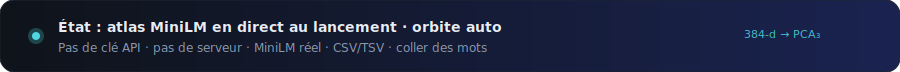

<p align="center">
  
</p>

# Observatoire de l'Espace Latent

<p align="center">
  <a href="README.md"></a>
  <a href="README.es.md"></a>
  <a href="README.fr.md"></a>
  <a href="README.de.md"></a>
  <a href="README.pt-BR.md"></a>
  <a href="README.zh-CN.md"></a>
  <a href="README.ja.md"></a>
  <a href="README.ko.md"></a>
  <a href="README.it.md"></a>
  <a href="README.ar.md"></a>
</p>

<p align="center">
  <a href="https://dacameragirl.github.io/latent-observatory/"></a>
  <a href="https://dacameragirl.github.io/links/"></a>
  
  
  
  
</p>

<p align="center">
  
</p>

**Explorez de vrais espaces d'embeddings en 3D — importez vos propres vecteurs ou intégrez du texte en direct avec un modèle exécuté dans votre navigateur.**

La recherche en IA génère d'énormes données à haute dimension — embeddings, activations, cartes d'attention — et presque tout le monde les regarde via des graphiques plats en 2D. Cet outil rend un espace d'embeddings comme un monde 3D navigable, construit avec la même boîte à outils que ParaView. Il démarre instantanément avec un **champ démo de 20 000 points** et orbite automatique ; passez aux embeddings **en direct** `all-MiniLM-L6-v2`, vos propres mots ou un fichier importé.

<p align="center">
  
</p>

<p align="center">
  
</p>

## Dépôt vs. app en ligne

| Quoi | URL |
|---|---|
| **App en ligne** | [dacameragirl.github.io/latent-observatory](https://dacameragirl.github.io/latent-observatory/) |
| **Dépôt GitHub** | [github.com/DaCameraGirl/latent-observatory](https://github.com/DaCameraGirl/latent-observatory) |
| **Hub projet** | [dacameragirl.github.io/links](https://dacameragirl.github.io/links/) (outils IA) |

<p align="center">
  
</p>

## Trois chemins de données réels

| Chemin | Vous faites | L'app fait |
|---|---|---|
| **Atlas de concepts** | Ouvrir l'app | Charge MiniLM, intègre un vocabulaire curaté, PCA → 3D, coloré par catégorie |
| **Vos mots** | Coller des lignes | Intègre en direct, regroupe par sens (k-means) dans la projection PCA |
| **Votre fichier** | Importer CSV/TSV | Analyse, réduit et regroupe **dans un worker en arrière-plan**, puis rend |

Le chemin fichier est ce qui en fait un outil, pas un jouet.

### Formats d'import

Déposez un fichier sur la fenêtre ou utilisez **Choisir CSV / TSV**. Le worker détecte automatiquement :

- **Colonnes `x,y,z`** → utilisées directement comme coordonnées 3D.
- **Nombreuses colonnes numériques** → chaque ligne est un vecteur, réduit à 3D avec **PCA**.
- **Une colonne `text`** → intégrée en direct avec le modèle, puis réduite.

Une colonne optionnelle **`label`/`category`** colore les points par catégorie ; sinon, les points sont colorés selon les grappes découvertes dans la projection. Un fichier d'exemple se trouve dans [`examples/sample_embeddings.csv`](examples/sample_embeddings.csv). Jusqu'à 20 000 lignes sont rendues (1 000 pour l'intégration de texte en direct) ; le HUD affiche le nom du fichier, le nombre de points et ce qui a été détecté.

## Points forts

| Fonction | Description |
|---|---|
| **Votre fichier** | Importez CSV/TSV de coordonnées, vecteurs ou texte ; réduit dans un worker en arrière-plan |
| **Atlas de concepts** | 12 catégories curatées — voyez comment MiniLM regroupe réellement le sens en 3D |
| **Vos mots** | Collez des lignes, intégrez en direct, regroupement auto avec k-means dans la projection PCA |
| **Sonde de requête** | Balayez un point dans l'espace ; coloration par distance avec viridis / inferno / plasma |
| **Isosurface nébuleuse** | Enveloppe marching-cubes optionnelle sur le champ de densité splatté |
| **100% côté client** | HTML/CSS/JS statique, vtk.js depuis un CDN épinglé, import dynamique Transformers.js |

<p align="center">
  
</p>

## Pourquoi vtk.js (le lien avec ParaView)

ParaView est construit sur **VTK** (Visualization Toolkit, par Kitware). **vtk.js** est le port WebGL de Kitware de cette même boîte à outils — c'est ce que ParaView Glance utilise pour rendre dans le navigateur. Cela conserve l'ADN réel de ParaView (champs scientifiques, isosurfaces, coloration scalaire) tout en éliminant l'installation bureau.

## Architecture

```text
index.html             Coque UI + panneau de contrôle ; charge vtk.js (épinglé) puis les modules de l'app
styles/observatory.css chrome glassmorphism espace profond
src/palette.js         couleurs catégorielles + cartes de couleurs viridis/inferno/plasma
src/reduce.js          PCA + k-means, partagé par la page et le worker (s'attache à self)
src/real.js            embeddings modèle en direct (Transformers.js) : atlas + mots personnalisés
src/upload.js          contrôleur d'ingestion de fichiers (sélecteur + glisser-déposer)
src/worker.js          analyse CSV/TSV + réduction de dimension hors thread UI
src/app.js             scène vtk.js ; toutes les données entrent via OBS.app.loadExternal(pos, colors, meta)
docs/assets/           héros README, orbite animée, art de sections sombres
.github/workflows/     CI (vérification syntaxe) + déploiement GitHub Pages
```

<p align="center">
  
</p>

## Contrôles

| Contrôle | Description |
|---|---|
| **Vos données → Choisir CSV / TSV** | Importez et explorez vos propres embeddings ou texte |
| **Recharger l'atlas de concepts** | Réintègre le vocabulaire curaté 12×12 |
| **Vos mots → Intégrer** | Collez des lignes et regroupez-les en 3D |
| **Coloration → par groupe** | Coloration catégorielle fournie avec les données |
| **Coloration → distance de requête** | Colore par distance à une sonde mobile ; choisissez une palette |
| **Sonde X/Y/Z** | Déplacez le point de requête dans l'espace |
| **Taille des points / Opacité** | Ajustez la lueur |
| **Isosurface nébuleuse** | Enveloppe de densité marching-cubes (+ niveau iso) |
| **Orbite automatique** | Rotation cinématique ; affiche les FPS en direct |

Souris : glisser pour pivoter, molette pour zoomer, clic droit + glisser pour déplacer (trackball vtk.js).

<p align="center">
  
</p>

## Développement local

Aucun build requis — voir [CONTRIBUTING.md](CONTRIBUTING.md).

```bash
npm start          # sert sur http://localhost:3000
npm run check      # node --check sur chaque src/*.js (sans navigateur)
```

## Feuille de route

- Option UMAP aux côtés de PCA pour les structures non linéaires.
- Ingestion Parquet et UI de mappage de colonnes pour schémas arbitraires.
- Export glTF d'une scène capturée ; URL partageable avec caméra/sonde intégrées.
- Séquences d'embeddings par checkpoint comme vraie timeline de relecture d'entraînement.

## Contributeurs

- **Angela Hudson** ([DaCameraGirl](https://github.com/DaCameraGirl)) — direction produit, tests, placement sur le hub
- **Claude** — app principale, scène vtk.js, mode embeddings réels, pipeline d'import, workflow GitHub

## Licence

© 2026 Angela Hudson (DaCameraGirl). Tous droits réservés. Voir [LICENSE](LICENSE).