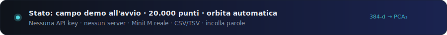

<p align="center">
  
</p>

# Osservatorio dello Spazio Latente

<p align="center">
  <a href="README.md"></a>
  <a href="README.es.md"></a>
  <a href="README.fr.md"></a>
  <a href="README.de.md"></a>
  <a href="README.pt-BR.md"></a>
  <a href="README.zh-CN.md"></a>
  <a href="README.ja.md"></a>
  <a href="README.ko.md"></a>
  <a href="README.it.md"></a>
  <a href="README.ar.md"></a>
</p>

<p align="center">
  <a href="https://dacameragirl.github.io/latent-observatory/"></a>
  <a href="https://dacameragirl.github.io/links/"></a>
  
  
  
  
</p>

<p align="center">
  
</p>

**Esplora spazi di embeddings reali in 3D — carica i tuoi vettori o incorpora testo in tempo reale con un modello che gira nel browser.**

La ricerca IA genera enormi dati ad alta dimensionalità — embeddings, attivazioni, mappe di attenzione — e quasi tutti li guardano attraverso grafici piatti 2D. Questo strumento rende uno spazio di embeddings come un mondo 3D navigabile, costruito con lo stesso toolkit di ParaView. All'avvio carica un **atlante di concetti live** con `all-MiniLM-L6-v2` (~25 MB al primo avvio); incorpora parole personalizzate o carica un file.

<p align="center">
  
</p>

<p align="center">
  
</p>

## Repository vs. app live

| Cosa | URL |
|---|---|
| **App live** | [dacameragirl.github.io/latent-observatory](https://dacameragirl.github.io/latent-observatory/) |
| **Repository GitHub** | [github.com/DaCameraGirl/latent-observatory](https://github.com/DaCameraGirl/latent-observatory) |
| **Hub progetto** | [dacameragirl.github.io/links](https://dacameragirl.github.io/links/) (strumenti IA) |

<p align="center">
  
</p>

## Tre percorsi dati reali

| Percorso | Tu fai | L'app fa |
|---|---|---|
| **Atlante dei concetti** | Apri l'app | Carica MiniLM, incorpora vocabolario curato, PCA → 3D, colorato per categoria |
| **Le tue parole** | Incolla righe | Incorpora live, raggruppa per significato (k-means) nella proiezione PCA |
| **Il tuo file** | Carica CSV/TSV | Analizza, riduce e raggruppa **in un worker in background**, poi renderizza |

Il percorso file è ciò che lo rende uno strumento, non un giocattolo.

### Formati di caricamento

Trascina un file sulla finestra o usa **Scegli CSV / TSV**. Il worker rileva automaticamente:

- **Colonne `x,y,z`** → usate direttamente come coordinate 3D.
- **Molte colonne numeriche** → ogni riga è un vettore, ridotto a 3D con **PCA**.
- **Una colonna `text`** → incorporata live con il modello, poi ridotta.

Una colonna opzionale **`label`/`category`** colora i punti per categoria; altrimenti i punti sono colorati per cluster scoperti nella proiezione. Un file di esempio è in [`examples/sample_embeddings.csv`](examples/sample_embeddings.csv). Fino a 20.000 righe vengono renderizzate (1.000 per incorporazione testo live); l'HUD mostra nome file, conteggio punti e rilevamenti.

## Punti salienti

| Funzione | Descrizione |
|---|---|
| **Il tuo file** | Carica CSV/TSV di coordinate, vettori o testo; ridotto in worker in background |
| **Atlante dei concetti** | 12 categorie curate — vedi come MiniLM raggruppa il significato in 3D |
| **Le tue parole** | Incolla righe, incorpora live, clustering automatico con k-means nella proiezione PCA |
| **Sonda di query** | Scorri un punto nello spazio; colora per distanza con viridis / inferno / plasma |
| **Isosuperficie nebulosa** | Guscio marching-cubes opzionale sul campo densità splattato |
| **100% lato client** | HTML/CSS/JS statico, vtk.js da CDN fissato, import dinamico Transformers.js |

<p align="center">
  
</p>

## Perché vtk.js (il legame con ParaView)

ParaView è costruito su **VTK** (Visualization Toolkit, di Kitware). **vtk.js** è la porta WebGL di Kitware dello stesso toolkit — è ciò che ParaView Glance usa per renderizzare nel browser. Così mantiene il vero DNA ParaView (campi scientifici, isosuperfici, colorazione scalare) eliminando l'installazione desktop.

## Architettura

```text
index.html             Shell UI + pannello di controllo; carica vtk.js (fissato) poi i moduli app
styles/observatory.css chrome glassmorphism deep-space
src/palette.js         colori categorici + colormap viridis/inferno/plasma
src/reduce.js          PCA + k-means, condiviso da pagina e worker (si attacca a self)
src/real.js            embeddings modello live (Transformers.js): atlante + parole personalizzate
src/upload.js          controller ingestione file (selettore file + drag-and-drop)
src/worker.js          parsing CSV/TSV + riduzione dimensionalità fuori dal thread UI
src/app.js             scena vtk.js; tutti i dati entrano via OBS.app.loadExternal(pos, colors, meta)
docs/assets/           hero README, orbita animata, arte sezioni scure
.github/workflows/     CI (controllo sintassi) + deploy GitHub Pages
```

<p align="center">
  
</p>

## Controlli

| Controllo | Descrizione |
|---|---|
| **I tuoi dati → Scegli CSV / TSV** | Carica ed esplora i tuoi embeddings o testo |
| **Ricarica atlante concetti** | Re-incorpora il vocabolario curato 12×12 |
| **Le tue parole → Incorpora** | Incolla righe e raggruppale in 3D |
| **Colorazione → per gruppo** | Colorazione categorica fornita con i dati |
| **Colorazione → distanza query** | Colore per distanza da sonda mobile; scegli colormap |
| **Sonda X/Y/Z** | Muovi il punto di query nello spazio |
| **Dimensione punti / Opacità** | Regola il bagliore |
| **Isosuperficie nebulosa** | Guscio densità marching-cubes (+ livello iso) |
| **Orbita automatica** | Rotazione cinematografica; mostra FPS live |

Mouse: trascina per ruotare, scroll per zoom, tasto destro + trascina per spostare (trackball vtk.js).

<p align="center">
  
</p>

## Sviluppo locale

Nessun build richiesto — vedi [CONTRIBUTING.md](CONTRIBUTING.md).

```bash
npm start          # serve su http://localhost:3000
npm run check      # node --check su ogni src/*.js (senza browser)
```

## Roadmap

- Opzione UMAP accanto a PCA per struttura non lineare.
- Ingestione Parquet e UI mappatura colonne per schemi arbitrari.
- Export glTF di una scena catturata; URL condivisibile con camera/sonda incorporate.
- Sequenze di embeddings per checkpoint come vera timeline di riproduzione training.

## Collaboratori

- **Angela Hudson** ([DaCameraGirl](https://github.com/DaCameraGirl)) — direzione prodotto, test, posizionamento hub
- **Claude** — app principale, scena vtk.js, modalità embeddings reali, pipeline upload, workflow GitHub

## Licenza

© 2026 Angela Hudson (DaCameraGirl). Tutti i diritti riservati. Vedi [LICENSE](LICENSE).