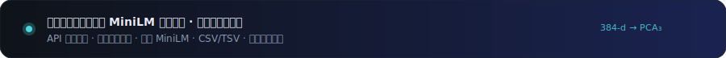

<p align="center">
  
</p>

# 潜在空間オブザーバトリー

<p align="center">
  <a href="README.md"></a>
  <a href="README.es.md"></a>
  <a href="README.fr.md"></a>
  <a href="README.de.md"></a>
  <a href="README.pt-BR.md"></a>
  <a href="README.zh-CN.md"></a>
  <a href="README.ja.md"></a>
  <a href="README.ko.md"></a>
  <a href="README.it.md"></a>
  <a href="README.ar.md"></a>
</p>

<p align="center">
  <a href="https://dacameragirl.github.io/latent-observatory/"></a>
  <a href="https://dacameragirl.github.io/links/"></a>
  <a href="https://dacameragirl.github.io/solar-planets/"></a>
  
  
  
  
</p>

<p align="center">
  
</p>

**実際の埋め込み空間を 3D で探索 — 独自のベクトルをアップロードするか、ブラウザで動作するモデルでテキストをライブ埋め込み。**

AI 研究は膨大な高次元データ — 埋め込み、アクティベーション、アテンションマップ — を生成しますが、ほとんどの人は平面の 2D プロットでしか見ていません。このツールは埋め込み空間をナビゲート可能な 3D 世界として描画し、ParaView と同じツールキットで構築されています。起動時に **ライブ** `all-MiniLM-L6-v2` コンセプトアトラスを読み込みます（初回 ~25 MB）。独自の単語の埋め込みやファイルのアップロードも可能です。

<p align="center">
  
</p>

<p align="center">
  
</p>

## リポジトリとライブアプリ

| 内容 | URL |
|---|---|
| **ライブアプリ** | [dacameragirl.github.io/latent-observatory](https://dacameragirl.github.io/latent-observatory/) |
| **GitHub リポジトリ** | [github.com/DaCameraGirl/latent-observatory](https://github.com/DaCameraGirl/latent-observatory) |
| **プロジェクトハブ** | [dacameragirl.github.io/links](https://dacameragirl.github.io/links/)（AI ツール） |
| **ソーラープラネッツ** | [dacameragirl.github.io/solar-planets](https://dacameragirl.github.io/solar-planets/)（太陽系スピンオフ） |

<p align="center">
  
</p>

## 3 つの実データパス

| パス | あなたの操作 | アプリの処理 |
|---|---|---|
| **概念アトラス** | アプリを開く | MiniLM を読み込み、キュレーション語彙を埋め込み、PCA → 3D、カテゴリで色分け |
| **あなたの言葉** | 行を貼り付け | ライブ埋め込み、PCA 投影で意味によるクラスタリング（k-means） |
| **あなたのファイル** | CSV/TSV をアップロード | **バックグラウンド worker** で解析・次元削減・クラスタリング後に描画 |

ファイルパスがこれをツールにし、おもちゃではなくしています。

### アップロード形式

ウィンドウにファイルをドロップするか **CSV / TSV を選択** を使用。worker が自動検出します：

- **`x,y,z` 列** → 3D 座標として直接使用。
- **多数の数値列** → 各行がベクトル、**PCA** で 3D に削減。
- **`text` 列** → モデルでライブ埋め込み後に削減。

オプションの **`label`/`category` 列** でカテゴリ別に色分け。なければ投影で発見されたクラスタで色分け。サンプルファイルは [`examples/sample_embeddings.csv`](examples/sample_embeddings.csv)。最大 20,000 行を描画（ライブテキスト埋め込みは 1,000 行）。HUD にファイル名、点数、検出内容を表示。

## ハイライト

| 機能 | 説明 |
|---|---|
| **あなたのファイル** | 座標・ベクトル・テキストの CSV/TSV をアップロード。バックグラウンド worker で削減 |
| **概念アトラス** | 12 のキュレーションカテゴリ — MiniLM が 3D で意味をどうクラスタするかを確認 |
| **あなたの言葉** | 行を貼り付け、ライブ埋め込み、PCA 投影で k-means 自動クラスタリング |
| **クエリプローブ** | 空間内の点をスイープ。viridis / inferno / plasma で距離による色分け |
| **ネビュラ等値面** | splat 密度場上のオプション marching-cubes シェル |
| **100% クライアント側** | 静的 HTML/CSS/JS、固定 CDN の vtk.js、Transformers.js 動的インポート |

<p align="center">
  
</p>

## なぜ vtk.js か（ParaView との関係）

ParaView は **VTK**（Visualization Toolkit、Kitware 製）上に構築されています。**vtk.js** は Kitware による同ツールキットの WebGL 移植版 — ParaView Glance がブラウザ描画に使用しています。科学的フィールド、等値面、スカラー色分けといった本物の ParaView DNA を保ちながら、デスクトップインストールは不要です。

## アーキテクチャ

```text
index.html             UI シェル + コントロールパネル。vtk.js（固定）読み込み後にアプリモジュール
styles/observatory.css ディープスペースのグラスモーフィズム UI
src/palette.js         カテゴリ色 + viridis/inferno/plasma カラーマップ
src/reduce.js          PCA + k-means、ページと worker で共有（self にアタッチ）
src/real.js            ライブモデル埋め込み（Transformers.js）：アトラス + カスタム語
src/upload.js          ファイル取り込みコントローラ（ファイル選択 + ドラッグ＆ドロップ）
src/worker.js          CSV/TSV 解析 + UI スレッド外での次元削減
src/app.js             vtk.js シーン。全データは OBS.app.loadExternal(pos, colors, meta) 経由
docs/assets/           README ヒーロー、アニメーション軌道、ダークセクションアート
.github/workflows/     CI（構文チェック）+ GitHub Pages デプロイ
```

<p align="center">
  
</p>

## コントロール

| コントロール | 説明 |
|---|---|
| **あなたのデータ → CSV / TSV を選択** | 独自の埋め込みやテキストをアップロードして探索 |
| **概念アトラスを再読み込み** | キュレーション 12×12 語彙を再埋め込み |
| **あなたの言葉 → 埋め込み** | 行を貼り付けて 3D でクラスタリング |
| **色分け → グループ別** | データ付属のカテゴリ色分け |
| **色分け → クエリ距離** | 移動可能なプローブへの距離で色分け。カラーマップを選択 |
| **プローブ X/Y/Z** | クエリ点を空間内で移動 |
| **点サイズ / 不透明度** | グローを調整 |
| **ネビュラ等値面** | marching-cubes 密度シェル（+ iso レベル） |
| **自動オービット** | シネマティック回転。ライブ FPS を表示 |

マウス：ドラッグで回転、スクロールでズーム、右ドラッグでパン（vtk.js トラックボール）。

<p align="center">
  
</p>

## ローカル開発

ビルド不要 — [CONTRIBUTING.md](CONTRIBUTING.md) を参照。

```bash
npm start          # http://localhost:3000 で配信
npm run check      # 各 src/*.js に node --check（ブラウザ不要）
```

## ロードマップ

- 非線形構造のため PCA に加えて UMAP オプション。
- Parquet 取り込みと任意スキーマ用の列マッピング UI。
- キャプチャシーンの glTF エクスポート。カメラ/プローブ状態埋め込みの共有可能 URL。
- チェックポイントごとの埋め込みシーケンスを実際の学習再生タイムラインとして。

## コントリビューター

- **Angela Hudson** ([DaCameraGirl](https://github.com/DaCameraGirl)) — プロダクト方向性、テスト、ハブ配置
- **Claude** — コアアプリ、vtk.js シーン、実埋め込みモード、アップロードパイプライン、GitHub ワークフロー

## ライセンス

© 2026 Angela Hudson (DaCameraGirl)。無断転載を禁じます。[LICENSE](LICENSE) を参照。