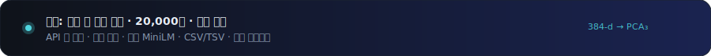

<p align="center">
  
</p>

# 잠재 공간 관측소

<p align="center">
  <a href="README.md"></a>
  <a href="README.es.md"></a>
  <a href="README.fr.md"></a>
  <a href="README.de.md"></a>
  <a href="README.pt-BR.md"></a>
  <a href="README.zh-CN.md"></a>
  <a href="README.ja.md"></a>
  <a href="README.ko.md"></a>
  <a href="README.it.md"></a>
  <a href="README.ar.md"></a>
</p>

<p align="center">
  <a href="https://dacameragirl.github.io/latent-observatory/"></a>
  <a href="https://dacameragirl.github.io/links/"></a>
  
  
  
  
</p>

<p align="center">
  
</p>

**실제 임베딩 공간을 3D로 탐험하세요 — 자체 벡터를 업로드하거나 브라우저에서 실행되는 모델로 텍스트를 실시간 임베딩합니다.**

AI 연구는 방대한 고차원 데이터 — 임베딩, 활성화, 어텐션 맵 — 를 생성하지만, 거의 모든 사람이 평면 2D 플롯으로만 봅니다. 이 도구는 임베딩 공간을 탐색 가능한 3D 세계로 렌더링하며, ParaView와 동일한 툴킷으로 구축되었습니다. **20,000점 데모 필드**와 자동 궤도로 즉시 시작합니다. **실시간** `all-MiniLM-L6-v2` 임베딩, 직접 입력한 단어, 업로드 파일로 전환할 수 있습니다.

<p align="center">
  
</p>

<p align="center">
  
</p>

## 저장소 vs. 라이브 앱

| 항목 | URL |
|---|---|
| **라이브 앱** | [dacameragirl.github.io/latent-observatory](https://dacameragirl.github.io/latent-observatory/) |
| **GitHub 저장소** | [github.com/DaCameraGirl/latent-observatory](https://github.com/DaCameraGirl/latent-observatory) |
| **프로젝트 허브** | [dacameragirl.github.io/links](https://dacameragirl.github.io/links/) (AI 도구) |

<p align="center">
  
</p>

## 세 가지 실제 데이터 경로

| 경로 | 사용자 작업 | 앱 처리 |
|---|---|---|
| **개념 아틀라스** | 앱 열기 | MiniLM 로드, 큐레이션 어휘 임베딩, PCA → 3D, 카테고리별 색상 |
| **내 단어** | 줄 붙여넣기 | 실시간 임베딩, PCA 투영에서 의미별 클러스터링 (k-means) |
| **내 파일** | CSV/TSV 업로드 | **백그라운드 worker**에서 파싱, 차원 축소, 클러스터링 후 렌더링 |

파일 경로가 이것을 장난감이 아닌 도구로 만듭니다.

### 업로드 형식

창에 파일을 드롭하거나 **CSV / TSV 선택**을 사용하세요. worker가 자동 감지합니다:

- **`x,y,z` 열** → 3D 좌표로 직접 사용.
- **많은 숫자 열** → 각 행이 벡터, **PCA**로 3D 축소.
- **`text` 열** → 모델로 실시간 임베딩 후 축소.

선택적 **`label`/`category` 열**로 범주별 색상 지정. 그렇지 않으면 투영에서 발견된 클러스터로 색상 지정. 샘플 파일은 [`examples/sample_embeddings.csv`](examples/sample_embeddings.csv). 최대 20,000행 렌더링 (실시간 텍스트 임베딩은 1,000행). HUD에 파일명, 점 수, 감지 내용 표시.

## 주요 기능

| 기능 | 설명 |
|---|---|
| **내 파일** | 좌표, 벡터 또는 텍스트 CSV/TSV 업로드. 백그라운드 worker에서 축소 |
| **개념 아틀라스** | 12개 큐레이션 카테고리 — MiniLM이 3D에서 의미를 어떻게 클러스터하는지 확인 |
| **내 단어** | 줄 붙여넣기, 실시간 임베딩, PCA 투영에서 k-means 자동 클러스터링 |
| **쿼리 프로브** | 공간을 가로지르는 점. viridis / inferno / plasma로 거리별 색상 |
| **네뷸라 등치면** | splat 밀도 필드 위 선택적 marching-cubes 셸 |
| **100% 클라이언트 측** | 정적 HTML/CSS/JS, 고정 CDN의 vtk.js, Transformers.js 동적 import |

<p align="center">
  
</p>

## 왜 vtk.js인가 (ParaView 연결)

ParaView는 **VTK**(Visualization Toolkit, Kitware) 위에 구축되었습니다. **vtk.js**는 Kitware의 동일 툴킷 WebGL 포트 — ParaView Glance가 브라우저 렌더링에 사용합니다. 과학 필드, 등치면, 스칼라 색상 지정 등 진정한 ParaView DNA를 유지하면서 데스크톱 설치는 완전히 제거합니다.

## 아키텍처

```text
index.html             UI 셸 + 제어 패널. vtk.js(고정) 로드 후 앱 모듈
styles/observatory.css 딥 스페이스 글래스모피즘 UI
src/palette.js         범주 색상 + viridis/inferno/plasma 컬러맵
src/reduce.js          PCA + k-means, 페이지와 worker 공유 (self에 연결)
src/real.js            실시간 모델 임베딩 (Transformers.js): 아틀라스 + 사용자 단어
src/upload.js          파일 수집 컨트롤러 (파일 선택기 + 드래그 앤 드롭)
src/worker.js          CSV/TSV 파싱 + UI 스레드 외부 차원 축소
src/app.js             vtk.js 씬. 모든 데이터는 OBS.app.loadExternal(pos, colors, meta) 경유
docs/assets/           README 히어로, 애니메이션 궤도, 다크 섹션 아트
.github/workflows/     CI (구문 검사) + GitHub Pages 배포
```

<p align="center">
  
</p>

## 컨트롤

| 컨트롤 | 설명 |
|---|---|
| **내 데이터 → CSV / TSV 선택** | 자체 임베딩 또는 텍스트 업로드 및 탐색 |
| **개념 아틀라스 다시 로드** | 큐레이션 12×12 어휘 재임베딩 |
| **내 단어 → 임베딩** | 줄 붙여넣고 3D에서 클러스터링 |
| **색상 → 그룹별** | 데이터와 함께 제공된 범주 색상 |
| **색상 → 쿼리 거리** | 이동 가능한 프로브까지의 거리로 색상. 컬러맵 선택 |
| **프로브 X/Y/Z** | 쿼리 점을 공간에서 이동 |
| **점 크기 / 불투명도** | 글로우 조정 |
| **네뷸라 등치면** | marching-cubes 밀도 셸 (+ iso 레벨) |
| **자동 궤도** | 시네마틱 회전. 실시간 FPS 표시 |

마우스: 드래그로 회전, 스크롤로 줌, 우클릭 드래그로 팬 (vtk.js 트랙볼).

<p align="center">
  
</p>

## 로컬 개발

빌드 불필요 — [CONTRIBUTING.md](CONTRIBUTING.md) 참조.

```bash
npm start          # http://localhost:3000 에서 서빙
npm run check      # 각 src/*.js에 node --check (브라우저 불필요)
```

## 로드맵

- 비선형 구조를 위한 PCA와 함께 UMAP 옵션.
- Parquet 수집 및 임의 스키마용 열 매핑 UI.
- 캡처된 씬의 glTF보내기. 카메라/프로브 상태가 포함된 공유 가능 URL.
- 체크포인트별 임베딩 시퀀스를 실제 학습 재생 타임라인으로.

## 기여자

- **Angela Hudson** ([DaCameraGirl](https://github.com/DaCameraGirl)) — 제품 방향, 테스트, 허브 배치
- **Claude** — 핵심 앱, vtk.js 씬, 실제 임베딩 모드, 업로드 파이프라인, GitHub 워크플로

## 라이선스

© 2026 Angela Hudson (DaCameraGirl). 모든 권리 보유. [LICENSE](LICENSE) 참조.