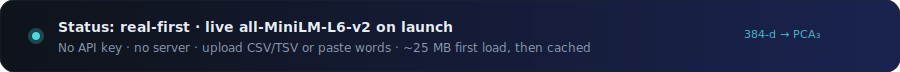

<p align="center">
  
</p>

# Latent Space Observatory

<p align="center">
  <a href="README.md"></a>
  <a href="README.es.md"></a>
  <a href="README.fr.md"></a>
  <a href="README.de.md"></a>
  <a href="README.pt-BR.md"></a>
  <a href="README.zh-CN.md"></a>
  <a href="README.ja.md"></a>
  <a href="README.ko.md"></a>
  <a href="README.it.md"></a>
  <a href="README.ar.md"></a>
</p>

<p align="center">
  <a href="https://dacameragirl.github.io/latent-observatory/"></a>
  <a href="https://dacameragirl.github.io/links/"></a>
  <a href="https://dacameragirl.github.io/solar-planets/"></a>
  
  
  
  
</p>

<p align="center">
  
</p>

**Explore real embedding spaces in 3D — upload your own vectors, or embed text live with a model running in your browser.**

AI research generates enormous high-dimensional data — embeddings, activations, attention
maps — and almost everyone looks at it through flat 2D plots. This tool renders an embedding
space as a navigable 3D world, built on the same toolkit ParaView is made of. On launch it
loads a **live** `all-MiniLM-L6-v2` concept atlas (~25 MB first run); embed your own words or upload a file.

<p align="center">
  
</p>

<p align="center">
  
</p>

## Repo vs live

| What | URL |
|---|---|
| **Live app** | [dacameragirl.github.io/latent-observatory](https://dacameragirl.github.io/latent-observatory/) |
| **GitHub repo** | [github.com/DaCameraGirl/latent-observatory](https://github.com/DaCameraGirl/latent-observatory) |
| **Project hub** | [dacameragirl.github.io/links](https://dacameragirl.github.io/links/) (AI tools) |
| **Solar Planets** | [dacameragirl.github.io/solar-planets](https://dacameragirl.github.io/solar-planets/) (cinematic solar system spin-off) |

<p align="center">
  
</p>

## Three real data paths

| Path | You do | The app does |
|---|---|---|
| **Concept atlas** | Open the app | Loads MiniLM, embeds a curated vocabulary, PCA → 3D, colored by category |
| **Your words** | Paste lines | Embeds live, clusters by meaning (k-means) in the PCA projection |
| **Your file** | Upload CSV/TSV | Parses, reduces, and clusters **in a background worker**, then renders |

The file path is what makes it a tool, not a toy.

### Upload formats

Drop a file on the window or use **Choose CSV / TSV**. The worker auto-detects:

- **`x,y,z` columns** → used directly as 3D coordinates.
- **Many numeric columns** → each row is a vector, reduced to 3D with **PCA**.
- **A `text` column** → embedded live with the model, then reduced.

An optional **`label`/`category`** column colors points categorically; otherwise points are
colored by clusters discovered in the projection. A sample file lives in
[`examples/sample_embeddings.csv`](examples/sample_embeddings.csv). Up to 20,000 rows render
(1,000 for live text embedding); the HUD shows the file name, point count, and what was
detected.

## Highlights

| Feature | What it does |
|---|---|
| **Your file** | Upload CSV/TSV of coordinates, vectors, or text; reduced in a background worker |
| **Concept atlas** | 12 curated categories — see how MiniLM actually clusters meaning in 3D |
| **Your words** | Paste lines, embed live, auto-cluster with k-means in the PCA projection |
| **Query probe** | Sweep a point through space; color by distance with viridis / inferno / plasma |
| **Nebula isosurface** | Optional marching-cubes shell over the splatted density field |
| **100% client-side** | Static HTML/CSS/JS, vtk.js from a pinned CDN, Transformers.js dynamic import |

<p align="center">
  
</p>

## Why vtk.js (the ParaView connection)

ParaView is built on **VTK** (the Visualization Toolkit, by Kitware). **vtk.js** is Kitware's
WebGL port of that same toolkit — it's what ParaView Glance uses to render in the browser. So
this keeps real ParaView DNA (scientific fields, isosurfaces, scalar coloring) while shedding
the desktop install entirely.

## Architecture

```text
index.html             UI shell + control panel; loads vtk.js (pinned) then the app modules
styles/observatory.css deep-space glassmorphism chrome
src/palette.js         categorical colors + viridis/inferno/plasma colormaps
src/reduce.js          PCA + k-means, shared by the page and the worker (attaches to self)
src/real.js            live model embeddings (Transformers.js): atlas + custom words
src/upload.js          file ingestion controller (file picker + drag-and-drop)
src/worker.js          CSV/TSV parsing + dimensionality reduction off the UI thread
src/app.js             vtk.js scene; all data enters via OBS.app.loadExternal(pos, colors, meta)
docs/assets/           README hero, animated orbit, dark section art
.github/workflows/     CI (syntax check) + GitHub Pages deploy
```

<p align="center">
  
</p>

## Controls

| Control | What it does |
|---|---|
| **Your data → Choose CSV/TSV** | Upload and explore your own embeddings or text |
| **Reload concept atlas** | Re-embed the curated 12×12 vocabulary |
| **Your words → Embed** | Paste lines and cluster them in 3D |
| **Coloring → by group** | Categorical coloring supplied with the data |
| **Coloring → query distance** | Color by distance to a movable probe; pick a colormap |
| **Probe X/Y/Z** | Move the query point through the space |
| **Point size / Opacity** | Tune the glow |
| **Nebula isosurface** | Marching-cubes density shell (+ iso level) |
| **Auto-orbit** | Cinematic rotation; shows live FPS |

Mouse: drag to rotate, scroll to zoom, right-drag to pan (vtk.js trackball).

<p align="center">
  
</p>

## Develop locally

No build required — see [CONTRIBUTING.md](CONTRIBUTING.md).

```bash
npm start          # serve at http://localhost:3000
npm run check      # node --check every src/*.js (no browser needed)
```

## Roadmap

- UMAP option alongside PCA for non-linear structure.
- Parquet ingestion and a column-mapping UI for arbitrary schemas.
- glTF export of a captured scene; shareable URL with embedded camera/probe state.
- Per-checkpoint embedding sequences as a real training-playback timeline.

## Contributors

- **Angela Hudson** ([DaCameraGirl](https://github.com/DaCameraGirl)) — product direction, testing, hub placement
- **Claude** — core app, vtk.js scene, real-embeddings mode, upload pipeline, GitHub workflow

## License

© 2026 Angela Hudson (DaCameraGirl). All rights reserved. See [LICENSE](LICENSE).