<p align="center">
  
</p>

# 潜在空间观测站

<p align="center">
  <a href="README.md"></a>
  <a href="README.es.md"></a>
  <a href="README.fr.md"></a>
  <a href="README.de.md"></a>
  <a href="README.pt-BR.md"></a>
  <a href="README.zh-CN.md"></a>
  <a href="README.ja.md"></a>
  <a href="README.ko.md"></a>
  <a href="README.it.md"></a>
  <a href="README.ar.md"></a>
</p>

<p align="center">
  <a href="https://dacameragirl.github.io/latent-observatory/"></a>
  <a href="https://dacameragirl.github.io/links/"></a>
  
  
  
  
</p>

<p align="center">
  
</p>

**在 3D 中探索真实的嵌入空间 — 上传您自己的向量，或使用在浏览器中运行的模型实时嵌入文本。**

AI 研究会产生海量高维数据 — 嵌入、激活、注意力图 — 而几乎所有人都是通过平面 2D 图表来查看。本工具将嵌入空间渲染为可导航的 3D 世界，基于与 ParaView 相同的工具包构建。立即显示 **20,000 点演示场** 和自动轨道；可切换到**实时** `all-MiniLM-L6-v2` 嵌入、自定义词语或上传文件。

<p align="center">
  
</p>

<p align="center">
  
</p>

## 仓库与在线应用

| 内容 | URL |
|---|---|
| **在线应用** | [dacameragirl.github.io/latent-observatory](https://dacameragirl.github.io/latent-observatory/) |
| **GitHub 仓库** | [github.com/DaCameraGirl/latent-observatory](https://github.com/DaCameraGirl/latent-observatory) |
| **项目中心** | [dacameragirl.github.io/links](https://dacameragirl.github.io/links/)（AI 工具） |

<p align="center">
  
</p>

## 三条真实数据路径

| 路径 | 您的操作 | 应用的处理 |
|---|---|---|
| **概念图谱** | 打开应用 | 加载 MiniLM，嵌入精选词汇，PCA → 3D，按类别着色 |
| **您的文字** | 粘贴行 | 实时嵌入，在 PCA 投影中按语义聚类（k-means） |
| **您的文件** | 上传 CSV/TSV | 在**后台 worker** 中解析、降维并聚类，然后渲染 |

文件路径使它成为工具，而非玩具。

### 上传格式

将文件拖放到窗口或使用**选择 CSV / TSV**。worker 会自动检测：

- **`x,y,z` 列** → 直接用作 3D 坐标。
- **多个数值列** → 每行是一个向量，用 **PCA** 降至 3D。
- **`text` 列** → 使用模型实时嵌入，然后降维。

可选的 **`label`/`category` 列** 按类别为点着色；否则按投影中发现的聚类着色。示例文件位于 [`examples/sample_embeddings.csv`](examples/sample_embeddings.csv)。最多渲染 20,000 行（实时文本嵌入为 1,000 行）；HUD 显示文件名、点数和检测结果。

## 功能亮点

| 功能 | 说明 |
|---|---|
| **您的文件** | 上传坐标、向量或文本的 CSV/TSV；在后台 worker 中降维 |
| **概念图谱** | 12 个精选类别 — 查看 MiniLM 如何在 3D 中聚类语义 |
| **您的文字** | 粘贴行，实时嵌入，在 PCA 投影中用 k-means 自动聚类 |
| **查询探针** | 在空间中扫过一点；用 viridis / inferno / plasma 按距离着色 |
| **星云等值面** | 在 splat 密度场上可选的 marching-cubes 外壳 |
| **100% 客户端** | 静态 HTML/CSS/JS，vtk.js 来自固定 CDN，Transformers.js 动态导入 |

<p align="center">
  
</p>

## 为何使用 vtk.js（与 ParaView 的联系）

ParaView 基于 **VTK**（Visualization Toolkit，Kitware 出品）。**vtk.js** 是 Kitware 将同一工具包移植到 WebGL 的版本 — ParaView Glance 用它进行浏览器渲染。因此保留了真正的 ParaView 基因（科学场、等值面、标量着色），同时完全无需桌面安装。

## 架构

```text
index.html             UI 外壳 + 控制面板；加载 vtk.js（固定版本）后加载应用模块
styles/observatory.css 深空玻璃拟态界面
src/palette.js         分类颜色 + viridis/inferno/plasma 色图
src/reduce.js          PCA + k-means，页面与 worker 共享（挂载到 self）
src/real.js            实时模型嵌入（Transformers.js）：图谱 + 自定义文字
src/upload.js          文件摄取控制器（文件选择器 + 拖放）
src/worker.js          CSV/TSV 解析 + 在 UI 线程外进行降维
src/app.js             vtk.js 场景；所有数据通过 OBS.app.loadExternal(pos, colors, meta) 进入
docs/assets/           README 头图、动画轨道、深色分区插图
.github/workflows/     CI（语法检查）+ GitHub Pages 部署
```

<p align="center">
  
</p>

## 控件

| 控件 | 说明 |
|---|---|
| **您的数据 → 选择 CSV / TSV** | 上传并探索您自己的嵌入或文本 |
| **重新加载概念图谱** | 重新嵌入精选的 12×12 词汇 |
| **您的文字 → 嵌入** | 粘贴行并在 3D 中聚类 |
| **着色 → 按组** | 使用数据提供的分类着色 |
| **着色 → 查询距离** | 按与可移动探针的距离着色；选择色图 |
| **探针 X/Y/Z** | 在空间中移动查询点 |
| **点大小 / 不透明度** | 调整发光效果 |
| **星云等值面** | marching-cubes 密度外壳（+ iso 级别） |
| **自动轨道** | 电影式旋转；显示实时 FPS |

鼠标：拖动旋转，滚轮缩放，右键拖动平移（vtk.js trackball）。

<p align="center">
  
</p>

## 本地开发

无需构建 — 参见 [CONTRIBUTING.md](CONTRIBUTING.md)。

```bash
npm start          # 在 http://localhost:3000 提供服务
npm run check      # 对每个 src/*.js 运行 node --check（无需浏览器）
```

## 路线图

- 与 PCA 并行的 UMAP 选项，用于非线性结构。
- Parquet 摄取及任意模式的列映射 UI。
- 捕获场景的 glTF 导出；可分享 URL，嵌入相机/探针状态。
- 按检查点的嵌入序列，作为真实的训练回放时间线。

## 贡献者

- **Angela Hudson** ([DaCameraGirl](https://github.com/DaCameraGirl)) — 产品方向、测试、中心页放置
- **Claude** — 核心应用、vtk.js 场景、真实嵌入模式、上传管道、GitHub 工作流

## 许可证

© 2026 Angela Hudson (DaCameraGirl)。保留所有权利。参见 [LICENSE](LICENSE)。